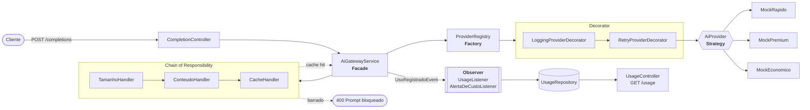

# ai-gateway

API Spring Boot que fica entre uma aplicação cliente e provedores de IA. A aplicação fala só com o gateway, e ele:

1. **escolhe o provedor** pelo perfil pedido (`RAPIDO`, `PREMIUM`, `ECONOMICO`), sem o cliente saber qual é;
2. **barra prompts ruins** antes de gastar dinheiro: grandes demais, com dado sensível, ou repetidos (respondidos do cache);
3. **tenta de novo** quando o provedor falha;
4. **registra o uso**: tokens, custo, provedor e cache hits de cada requisição.

Os provedores são **mocks**: sem chave de API, sem chamada externa, sem custo. Latência e falhas são simuladas.

Projeto do desafio de **Padrões de Projeto** do bootcamp *Java com IA* (DIO + Itaú). Sete padrões aplicados num problema real, cada um resolvendo uma dor que aparece no código antes dele.

> Guia de estudo completo, padrão por padrão, com o código comentado: **[docs/PADROES.md](docs/PADROES.md)**

---

## Padrões aplicados

| Padrão | Problema que resolve aqui | Onde | Origem |
|---|---|---|---|
| **Strategy** | Cada provedor de IA gera a resposta do seu jeito, mas o gateway precisa tratar todos igual | [`AiProvider`](src/main/java/br/com/rafael/aigateway/provider/AiProvider.java) e os três `Mock*Provider` | aula |
| **Factory** (registry) | Alguém precisa decidir qual provedor atende cada perfil, sem `if` no service | [`ProviderRegistry`](src/main/java/br/com/rafael/aigateway/provider/ProviderRegistry.java) | evolução |
| **Chain of Responsibility** | Três regras antes da IA (tamanho, termo proibido, cache) sem um método de 50 linhas | [`core/chain/`](src/main/java/br/com/rafael/aigateway/core/chain/) | evolução |
| **Decorator** | Retry e log em todos os provedores, sem copiar código em cada um | [`provider/decorator/`](src/main/java/br/com/rafael/aigateway/provider/decorator/) | evolução |
| **Observer** | Registrar uso e alertar custo sem o service conhecer quem faz isso | [`usage/`](src/main/java/br/com/rafael/aigateway/usage/) | evolução |
| **Facade** | O controller chama um método só; a orquestração fica num lugar | [`AiGatewayService`](src/main/java/br/com/rafael/aigateway/core/AiGatewayService.java) | aula |
| **Singleton** | Um objeto por componente, compartilhado por todas as requisições | todos os beans (`@Service`, `@Component`, `@Repository`) | aula |

**Aula** = padrão apresentado nos laboratórios da DIO. **Evolução** = padrão que vai além do que a aula cobriu.

---

## Caminho de uma requisição



O log de uma requisição mostra os padrões trabalhando em ordem:

```
[chain] TamanhoHandler: 17 tokens, aprovado
[chain] ConteudoHandler: nenhum termo bloqueado
[chain] CacheHandler: miss, seguindo
[strategy] perfil PREMIUM resolvido para MOCK_PREMIUM
[decorator] MOCK_PREMIUM tentativa 1 de 3
[decorator] MOCK_PREMIUM concluído em 809ms, 50 tokens
[observer] alerta de custo: requisição 1a6b9ad7-... custou 0.010000 (limite 0.005)
[observer] uso registrado: 50 tokens, custo 0.010000, cacheHit false
```

---

## Como rodar

Requisitos: Java 21 ou superior. O Maven vem embutido (`./mvnw`).

```bash
./mvnw spring-boot:run
```

A API sobe em `http://localhost:8080`. Swagger em **http://localhost:8080/swagger-ui.html**.

Testes:

```bash
./mvnw test
```

---

## Endpoints

### `POST /completions`

```bash
curl -X POST localhost:8080/completions \
  -H "Content-Type: application/json" \
  -d '{"prompt":"Explique injeção de dependência","perfil":"RAPIDO"}'
```

```json
{
  "id": "6e0e9f3c-c429-478b-b609-42cb5d6b7cc2",
  "resposta": "[MOCK_RAPIDO] Resposta curta para: Explique injeção de dependência",
  "provedorUsado": "MOCK_RAPIDO",
  "tokensGastos": 23,
  "custoEstimado": 0.000460,
  "cacheHit": false,
  "duracaoMs": 105
}
```

Os três caminhos possíveis:

| Caso | O que acontece | Resposta |
|---|---|---|
| Caminho feliz | Passa pela corrente, provedor responde | `200`, `cacheHit: false` |
| Mesmo prompt e perfil de novo | `CacheHandler` responde, provedor não é chamado | `200`, `cacheHit: true`, custo `0`, poucos ms |
| Mais de 100 tokens ou termo proibido | Corrente barra antes do provedor | `400`, `title: "Prompt bloqueado"` |
| `ECONOMICO` falhou 3 vezes seguidas | Retry esgotou | `503`, `title: "Provedor indisponível"` |
| JSON inválido, perfil inexistente, prompt vazio | Validação do Spring | `400`, mesmo formato `ProblemDetail` |

Todos os erros seguem o formato `ProblemDetail` (RFC 9457):

```json
{ "title": "Prompt bloqueado", "status": 400, "detail": "Prompt contém termo bloqueado: senha", "instance": "/completions" }
```

### `GET /usage`

Resumo do que o gateway já processou:

```json
{
  "totalRequisicoes": 3,
  "cacheHits": 1,
  "totalTokens": 73,
  "custoTotal": 0.01046,
  "porProvedor": { "MOCK_PREMIUM": 1, "MOCK_RAPIDO": 2 },
  "ultimas": [ { "requisicaoId": "...", "perfil": "PREMIUM", "provedor": "MOCK_PREMIUM", "tokens": 50, "custo": 0.01, "cacheHit": false, "duracaoMs": 812, "momento": "2026-10-06T01:26:51Z" } ]
}
```

### Perfis

| Perfil | Provedor | Latência | Preço por mil tokens | Particularidade |
|---|---|---|---|---|
| `RAPIDO` | `MOCK_RAPIDO` | 100 ms | R$ 0,02 | |
| `PREMIUM` | `MOCK_PREMIUM` | 800 ms | R$ 0,20 | resposta mais longa |
| `ECONOMICO` | `MOCK_ECONOMICO` | 150 ms | R$ 0,01 | falha em 40% das chamadas; o retry cobre |

### Configuração

Em [`application.properties`](src/main/resources/application.properties):

| Propriedade | Padrão | Para quê |
|---|---|---|
| `gateway.chain.max-tokens` | `100` | limite do `TamanhoHandler` |
| `gateway.chain.termos-proibidos` | `senha,cpf,cartao de credito` | lista do `ConteudoHandler` (compara sem acento e sem caixa) |
| `gateway.provider.max-tentativas` | `3` | tentativas do `RetryProviderDecorator` |
| `gateway.provider.economico.taxa-falha` | `0.4` | chance de falha do `MOCK_ECONOMICO` |
| `gateway.usage.alerta-custo` | `0.005` | custo por requisição que dispara alerta no log |

---

## Relação com o laboratório da DIO

Os três padrões da aula, comparados com os laboratórios oficiais ([Java puro](https://github.com/digitalinnovationone/lab-padroes-projeto-java) e [Spring](https://github.com/digitalinnovationone/lab-padroes-projeto-spring)):

| Padrão | No laboratório | No ai-gateway | Diferença principal |
|---|---|---|---|
| **Strategy** | `Robo` guarda um `Comportamento` e troca por `setComportamento()`. O `Test.main` escolhe a estratégia | Os provedores implementam `AiProvider`, o Spring entrega todos numa `List`, e o `ProviderRegistry` escolhe pelo perfil | No lab, quem usa a estratégia (o `main`) escolhe na mão. Aqui a escolha sai do cliente e vai para um registry (Factory). Sem setter: o bean é compartilhado, e trocar estratégia por setter num singleton seria condição de corrida |
| **Singleton** | Três versões na mão: `SingletonEager`, `SingletonLazy` e `SingletonLazyHolder` (construtor privado + `getInstancia()`) | Nenhum singleton escrito na mão. O container do Spring cria um bean de cada componente (escopo `singleton` padrão) | Não implementar Singleton na mão em Spring: o container já garante, e a classe continua testável (dá para dar `new` nos testes). O cuidado que sobra é não guardar estado de requisição em campo |
| **Facade** | `Facade.migrarCliente()` esconde `CepApi` e `CrmService`. No lab Spring, `ClienteServiceImpl` esconde repositórios e ViaCEP | `AiGatewayService.processar()` esconde a corrente, o registry, o cache e a publicação de evento | Mesma ideia. Aqui a fachada coordena subsistemas que são, eles mesmos, outros padrões |

**Factory, Chain of Responsibility, Decorator e Observer** são a evolução em relação à aula.

---

## Antes e depois: Chain of Responsibility

O histórico de commits guarda as duas versões de propósito.

**Antes** (`2c1aa93`): as três regras dentro do service.

```java
int tokensGastos = completionRequest.prompt().length() / 4;
if (tokensGastos > 100) {
    throw new PromptBloqueadoException("Prompt com " + tokensGastos + " tokens, o limite e 100");
}
String promptMinusculo = completionRequest.prompt().toLowerCase();
for (String termo : termosProibidos) {
    if (promptMinusculo.contains(termo)) {
        throw new PromptBloqueadoException("Prompt contem termo bloqueado: " + termo);
    }
}
String chave = completionRequest.perfil() + ":" + completionRequest.prompt();
CompletionResponse emCache = cache.get(chave);
if (emCache != null) { /* monta resposta de cache e retorna */ }
// ... só aqui começa o trabalho do gateway
```

Cada regra nova abriria este método de novo, e ele já misturava validação, cache e chamada ao provedor.

**Depois** (`ab90c9a`): cada regra é uma classe, e o service só puxa a corrente.

```java
ContextoRequisicao ctx = new ContextoRequisicao(requisicao);
corrente.executar(ctx);                 // Tamanho -> Conteudo -> Cache, na ordem do @Order
if (ctx.respostaPronta().isPresent()) { ... }
```

Uma regra nova é uma classe nova com `@Component` e `@Order`. Nenhum arquivo existente muda.

---

## Histórico de commits

Um commit por módulo. Cada padrão entra quando a dor dele aparece no código.

| Commit | Módulo |
|---|---|
| `9ce2dab` feat: setup do projeto e endpoint de completions | 0. Fundação |
| `5cf3d80` add: AiGatewayService first version | 1. Strategy, versão feia (`if/else` de perfil) |
| `4bec2f5` refactor: extrai provedores para Strategy | 1. Strategy |
| `2aebace` feat: registry de provedores | 2. Factory |
| `2c1aa93` feat: validacoes do prompt no service | 3. Chain, versão feia |
| `ab90c9a` refactor: validacoes viram Chain of Responsibility | 3. Chain |
| `fa2598a` feat: retry e log via Decorator | 4. Decorator |
| `368def5` feat: registro de uso via eventos | 5. Observer |
| `80b8200` refactor: fachada do gateway | 6. Facade e Singleton |
| `f3b9044` test: cobertura dos padroes aplicados | 7. Testes |
| docs: README, guia dos padroes, Swagger e diagrama | 8. Entrega |

---

## Estrutura

```
br.com.rafael.aigateway
├── api/                  entrada HTTP
│   ├── CompletionController     POST /completions
│   ├── UsageController          GET /usage
│   ├── GlobalExceptionHandler   exceção -> ProblemDetail
│   ├── OpenApiConfig            texto do Swagger
│   └── dto/                     CompletionRequest, CompletionResponse
├── core/                 o gateway
│   ├── AiGatewayService         Facade
│   ├── CacheDeRespostas         cache em memória
│   ├── PromptBloqueadoException
│   └── chain/                   Chain of Responsibility
├── provider/             provedores de IA
│   ├── AiProvider               Strategy
│   ├── ProviderRegistry         Factory (registry)
│   ├── Mock{Rapido,Premium,Economico}Provider
│   └── decorator/               Decorator (retry e log)
└── usage/                registro de uso
    ├── UsoRegistradoEvent       Observer (evento)
    ├── UsageListener, AlertaDeCustoListener   Observer (observadores)
    ├── UsageRepository
    └── ResumoUso
```

## Limitações conhecidas

- Cache e histórico de uso ficam em memória: somem quando a aplicação reinicia, e o cache não expira nem tem limite de tamanho. Em produção seriam Caffeine/Redis e um banco.
- A contagem de tokens é uma estimativa (`caracteres / 4`), não o tokenizador real de um modelo.
- O retry repete imediatamente, sem espera entre tentativas (*backoff*).

## Stack

Java 21 · Spring Boot 4.1.1 · Spring Web MVC · Bean Validation · springdoc-openapi 3 · JUnit 6 · Mockito · AssertJ
